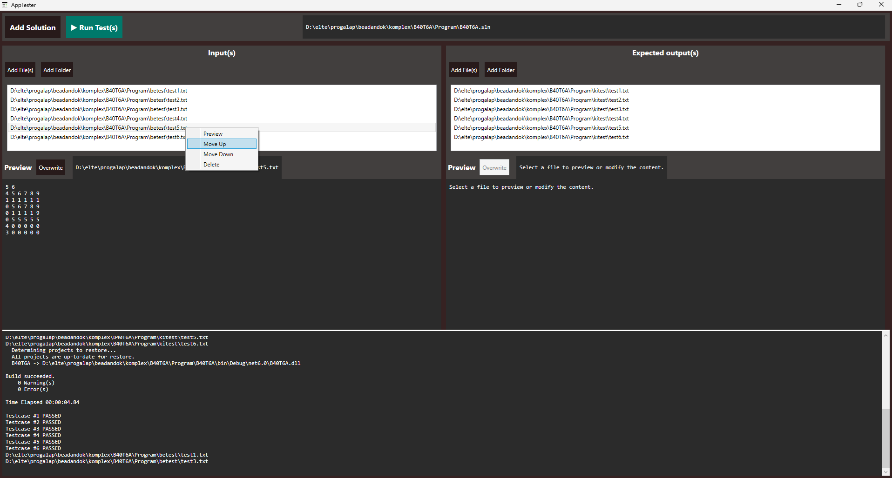
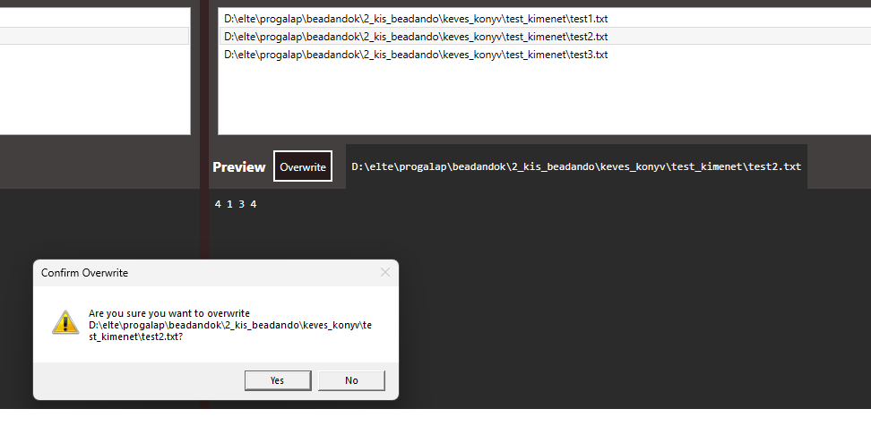
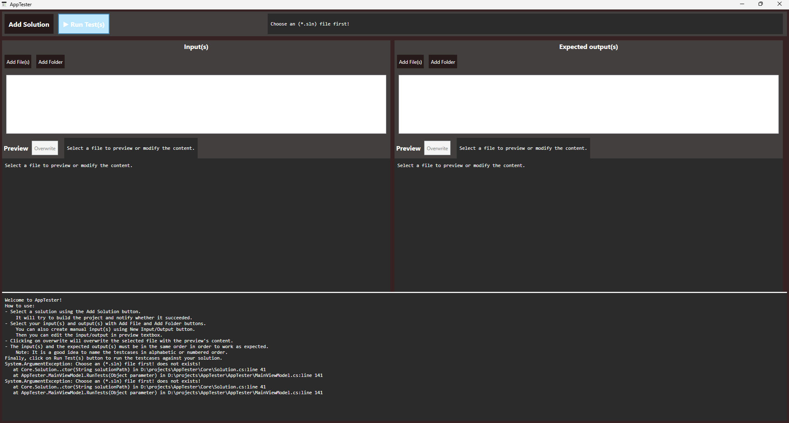

# AppTester - A WPF application for Console Applications

AppTester is a Windows Presentation Foundation (WPF) application built with .NET 9 and C#. It is designed to streamline the testing of console applications in a Windows environment.

## How To use

**Important:** The tester assumes that your code expects input, as it works by redirecting the input to the executable.

- Add a solution (.sln) file with the left-top **`Add Solution`** button.
- Select the `input file(s)` and `expected output file(s)`. Make sure they have .txt extension.
- Click on the Run Test(s) button positioned on the left-top part of the window.

## Key Features

- Solution Selection: Add a .sln file which automatically tries to build the solution.
- Input and Output Pairing: Automatically iterates through input and expected output files in the same order.
- Execution Feedback: Displays each step in a dedicated log area for transparency.
- Path Management:
	- Clickable and selectable paths.
	- Right-click context menu to delete, move up, or move down paths.
	- Dynamically update the list of paths.

This application is ideal for developers who want to automate the testing of console applications in a streamlined, Windows-native interface.

The project consists of two main components:
>**Core.dll**
>
> - Responsible for managing and building .sln solutions.
> - Automatically searches for .csproj files within the solution.
> - Determines whether the project is executable.
> - Builds the executable path for the solution.

> **AppTester GUI**
>
> - Provides a user-friendly interface for selecting solutions, input files, and expected output files or folders.
> - Features a Run button to execute the console application in the background using the provided inputs.
> - Redirects Console.Write output to a dedicated textbox for real-time feedback and logs.
> - Compares actual output with the expected output and provides feedback on the results.

---

**Future improvements**

- Implementing disable for Run Tests button based on build success of the choosen solution.
- More separated styles, including unique disabled button style.
- Separate class for I/O files to apply DRY principles.
- Option to add manual input with file creation.
- Proper async method implementation for building solution and running test to not prevent the user from interactive with other elements.
